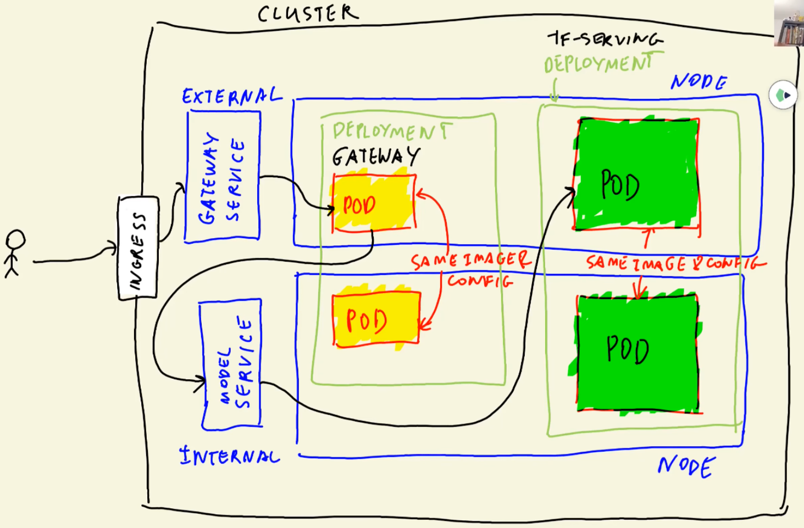

# Kubernetes

Kubernetes is a container orchestration system used to automatically deploy, scale and operate containers. 

In order to deploy a simple app with Kubernetes. We will need 2 additional tools:
* `Kind` (Kubernetes in Docker): this tool allows you to create a local Kubernetes cluster in your local computer.
* `kubectl` (pronounced _coob-control_): the Kubernetes command-line tool, used to run commands against Kubernetes clusters.

A Kubernetes `cluster` contains `nodes`, and nodes contain `pods`. Pods are grouped in deployments along different nodes. Deployments are accessed through `services`.

## Setting up a local Kubernetes cluster with Kind



Kind is a tool that will allow us to create a local Kubernetes cluster in our computer for learning and developing.

Installation instructions are available [on the official website](https://kind.sigs.k8s.io/docs/user/quick-start/).

Once Kind is installed, create a cluster with the following command (it may take a few minutes):

```sh
kind create cluster
```

>Note: you may delete a cluster with `kind delete cluster`

Once the cluster is created, in order to access it with `kubectl` we need to provide the kind cluster context to it. You may do so with the following command:

```sh
kubectl cluster-info --context kind-kind
```

You may now use `kubectl` to access the cluster. Try the following commands:

*   ```sh
    kubectl get service
    ```
    * It should return a single entry named `kubernetes`.
*   ```sh
    kubectl get pod
    ```
    * It should return `No resources found in default namespace.`
*   ```sh
    kubectl get deployment
    ```
    * It should return `No resources found in default namespace.`
*   ```sh
    docker ps
    ```
    * It should show a container running the `kindest` image, along with any other containers you might be running.

Kind makes use of Docker to simulate a cluster, which is why `docker ps` shows a container.

## Creating a deployment

Deployments in Kubernetes are defined with YAML files. Here's an example `deployment.yaml` file for our ping app:

```yaml
apiVersion: apps/v1
kind: Deployment
metadata: # name of the deployment
  name: ping-deployment
spec:
  replicas: 1 # number of pods to create
  selector:
    matchLabels: # all pods that have the label app name 'ping' are belonged to 'ping-deployment'
      app: ping
  template: # template of pods (all pods have same configuration)
    metadata:
      labels: # each app gets the same label (i.e., ping in our case)
        app: ping
    spec:
      containers: # name of the container
      - name: ping-pod
        image: ping:v001 # docker image with tag
        resources:
          limits:
            memory: "128Mi"
            cpu: "500m"
        ports:
        - containerPort: 9696 # port to expose
```
Before we run the deployment, we need to _load_ our image into our cluster nodes.

```sh
kind load docker-image ping:v1
```

We can now _apply_ our `deployment.yaml` file to our cluster:

```sh
kubectl apply -f deployment.yaml
```

>Note: you can check the status of your cluster by using the `kubectl get deployment` and `kubectl get pod` commands we saw before. In case of errors, you can get additional info from pods by using the `kubectl describe pod pod-name-taken-from-get-pod | less` command.

>Note 2: you can remove a deployment with `kubectl delete -f deployment.yaml`

Finally, we test that the deployment is working as intended. We can do so with ***port forwarding*** in order to access the pod.

```sh
kubectl port-forward pod-name-taken-from-get-pod 9696:9696
```
>Note: you will need to use `kubectl get pod` to get the name of the pod for the port forwarding command.

This command will temporarily forward the port of the pod so that we can access it from outside the cluster. You can stop the port forwarding by pressing `Ctrl+C` on your keyboard.

With the port forwarding running, run the same `curl` command from before:

```sh
curl localhost:9696/ping
```

You should get a `PONG` response from the cluster.

## Creating a service

We now need to offer permanent access from outside the cluster with a service. Services are also declared with YAML files.

Here's an example `service.yaml` file for our ping app:

```yaml
apiVersion: v1
kind: Service
metadata: # name of the service ('ping')
  name: ping-service
spec:
  type: LoadBalancer # type of the service (external in this case)
  selector: # which pods qualify for forwarding requests
    app: ping
  ports:
  - port: 80 # port of the service
    targetPort: 9696 # port of the pod
```

* The service will be named `ping-service` as stated on the `.metadata.name` field.
* The `ping-service` service will target the port 9696 of any pod with the `app=ping` label.
* The service will be external, AKA of `LoadBalancer` type. If this field is not specified, the default type would be `ClusterIP` (internal service).
* We can access the service on port 80.

With the `service.yaml` file created, we can now deploy it:

```sh
kubectl apply -f service.yaml
```

You can now check the state of the service with `kubectl get service` and test it with the `curl` command.

* ***IMPORTANT***: when checking the service status, you will most likely find that the LoadBalancer service we created has `<pending>` as its external IP value. We did not configure our cluster to assign IP's to LoadBalancers, so you will have to make use of port forwarding for testing.
*   ```sh
    kubectl port-forward service/ping-service 8080:80
    ```
* We use 8080:80 because port 80 locally is reserved for HTTP and would probably require root access to be changed, so we use port 8080 for the local port
*   ```sh
    curl localhost:8080/ping
    ```

## Autoscaling

Now we're going to use a [HorizontalPodAutoscaler](https://kubernetes.io/docs/tasks/run-application/horizontal-pod-autoscale-walkthrough/) (HPA for short) that automatically updates a workload resource (such as our deployment), with the aim of automatically scaling the workload to match demand.

Use the following command to create the HPA:

```bash
kubectl autoscale deployment subscription --name subscription-hpa --cpu-percent=20 --min=1 --max=3
```

You can check the current status of the new HPA by running:

```bash
kubectl get hpa
```